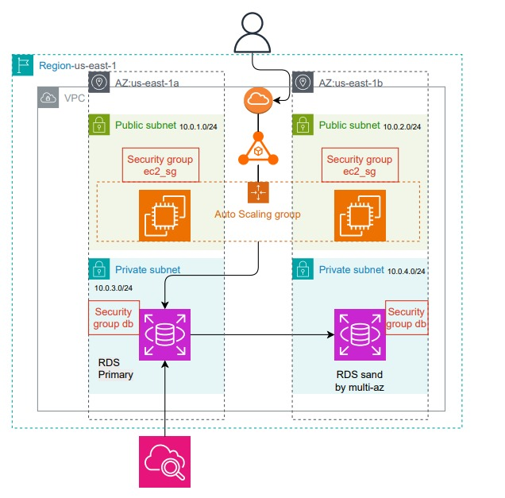

Guía de Usuario

Bienvenido a la guía de despliegue del obligatorio.
Este proyecto realiza un despliegue completo de infraestructura en AWS usando Terraform, ejecuta la aplicación del obligatorio dentro de un contenedor Docker, gestiona la base de datos en Amazon RDS, centraliza la seguridad mediante Security Groups, y realiza backups automáticos con AWS Backup.
Además, la solución escala automáticamente bajo demanda gracias al AutoScaling Group (ASG) y mantiene alta disponibilidad.

Descripción General

Este proyecto despliega una infraestructura completa, modular y automatizada en AWS utilizando Terraform.
La solución replica y mejora la arquitectura on-premise de un e-commerce, incorporando:

Balanceo de carga (ALB)
Escalado automático (ASG)
Servidores de aplicación en contenedores Docker
Base de datos MySQL en RDS
Subredes públicas y privadas
Seguridad basada en Security Groups
Backups automáticos mediante AWS Backup
Alta disponibilidad y tolerancia a fallos
Logs distribuidos y monitoreo (CloudWatch)
La aplicación se ejecuta dentro de un Auto Scaling Group, y cada instancia aplica un pipeline automático (definido en user_data.sh) que:
Instala dependencias
Clona tu repositorio
Clona el repo base del profesor
Construye la imagen Docker
Levanta la aplicación automáticamente
Esto asegura que cada EC2 que se crea por el ASG ya tenga la aplicación funcionando sin intervención manual.

Requisitos

Tener instalado Terraform
Tener instaldo AWS Cli
Haber modificado las credenciales AWS en la maquina local
Repositorio en Github

INSTALACIÓN 

1. Instalar Terraform
Permite automatizar toda la infraestructura del obligatorio.
sudo dnf config-manager --add-repo https://rpm.releases.hashicorp.com/RHEL/hashicorp.repo
sudo dnf install -y terraform

2. Instalar AWS CLI
Se utiliza para configurar las credenciales y permitir que Terraform hable con AWS.
wget "https://awscli.amazonaws.com/awscli-exe-linux-x86_64.zip"
unzip awscli-exe-linux-x86_64.zip
sudo ./aws/install

3. Configurar credenciales AWS
Necesario para que Terraform pueda crear recursos en AWS.
aws configure

4. Instalar Git
Permite clonar el repositorio del obligatorio y trabajar con control de versiones.
sudo dnf install -y git

5. Instalar Docker
Requerido para construir y ejecutar la aplicación dentro de contenedores (igual que hace el user_data en EC2).
sudo dnf install -y docker
sudo systemctl enable --now docker

6. Clonar este repositorio
Descarga el código del proyecto en tu máquina local.
**git clone https://github.com/lsanguinetti11/OBLIGATORIO.git**

7. Entrar al directorio del proyecto
Ubicación donde están los módulos y el main de Terraform.
**cd OBLIGATORIO/INFRA-MODULAR/TERRAFORM**

8. Inicializar Terraform
Prepara el entorno de trabajo y descarga los providers necesarios.
**terraform init**

9. Validar la sintaxis del proyecto
Asegura que la infraestructura esté correctamente definida.
**terraform validate**

10. Ver el plan de despliegue
Muestra qué recursos va a crear Terraform.
**terraform plan**

11. Aplicar los cambios
Crea toda la infraestructura automática (VPC, RDS, ALB, ASG y EC2).
**terraform apply -auto-approve -var-file terraform.tfvars**

## Arquitectura del Proyecto

# Descripción de los Componentes 

## Índice
- Root Module
- Módulo:backup
- Módulo:compute
- Módulo:monitoring
- Módulo:rds
- Módulo:vpc

## Root Module

### Inputs

| Name | Description | Type | Default | Required |
|------|-------------|------|---------|:--------:|
|  [ami](#input\_ami) | EC2 | `string` | `"ami-0cae6d6fe6048ca2c"` | no |
|  [app\_instance\_count](#input\_app\_instance\_count) | n/a | `string` | `"2"` | no |
|  [aws\_region](#input\_aws\_region) | n/a | `string` | `"us-east-1"` | no |
|  [db\_name](#input\_db\_name) | Nombre de la base de datos a crear en RDS | `string` | n/a | yes |
|  [db\_password](#input\_db\_password) | n/a | `string` | n/a | yes |
|  [db\_username](#input\_db\_username) | DB | `string` | n/a | yes |
|  [instance\_type](#input\_instance\_type) | n/a | `string` | `"t2.micro"` | no |
|  [key\_name](#input\_key\_name) | n/a | `string` | `"vockey"` | no |
|  [project](#input\_project) | n/a | `string` | `"ecommerce-php"` | no |
|  [ssh\_allowed\_cidr](#input\_ssh\_allowed\_cidr) | n/a | `string` | `"0.0.0.0/0"` | no |
|  [subnet\_private\_1a](#input\_subnet\_private\_1a) | n/a | `string` | `"10.0.3.0/24"` | no |
|  [subnet\_private\_1b](#input\_subnet\_private\_1b) | n/a | `string` | `"10.0.4.0/24"` | no |
|  [subnet\_public\_1a](#input\_subnet\_public\_1a) | n/a | `string` | `"10.0.1.0/24"` | no |
|  [subnet\_public\_1b](#input\_subnet\_public\_1b) | n/a | `string` | `"10.0.2.0/24"` | no |
|  [vpc\_az\_1a](#input\_vpc\_az\_1a) | n/a | `string` | `"us-east-1a"` | no |
|  [vpc\_az\_1b](#input\_vpc\_az\_1b) | n/a | `string` | `"us-east-1b"` | no |
|  [vpc\_cidr](#input\_vpc\_cidr) | n/a | `string` | `"10.0.0.0/16"` | no |

## Outputs

| Name | Description |
|------|-------------|
|  [alb\_dns](#output\_alb\_dns) | n/a |
|  [alb\_sg\_id](#output\_alb\_sg\_id) | n/a |
|  [asg\_name](#output\_asg\_name) | n/a |
|  [backup\_plan\_id](#output\_backup\_plan\_id) | n/a |
|  [backup\_vault\_name](#output\_backup\_vault\_name) | n/a |
|  [db\_endpoint](#output\_db\_endpoint) | Endpoint de la base de datos |
|  [db\_instance\_arn](#output\_db\_instance\_arn) | ARN de la instancia RDS |
|  [db\_security\_group\_id](#output\_db\_security\_group\_id) | ID del Security Group del RDS |
|  [ec2\_sg\_id](#output\_ec2\_sg\_id) | n/a |

## Módulo: backup

## Inputs

| Name | Description | Type | Default | Required |
|------|-------------|------|---------|:--------:|
|  [project](#input\_project) | Nombre base para los recursos | `string` | n/a | yes |
|  [rds\_arn](#input\_rds\_arn) | ARN de la instancia RDS | `string` | n/a | yes |

## Outputs

| Name | Description |
|------|-------------|
|  [backup\_plan\_id](#output\_backup\_plan\_id) | n/a |
|  [backup\_vault\_name](#output\_backup\_vault\_name) | n/a |

## Resources

| Name | Type |
|------|------|
| [aws_backup_plan.rds_backup_plan](https://registry.terraform.io/providers/hashicorp/aws/latest/docs/resources/backup_plan) | resource |
| [aws_backup_selection.rds_backup_selection](https://registry.terraform.io/providers/hashicorp/aws/latest/docs/resources/backup_selection) | resource |
| [aws_backup_vault.rds_backup_vault](https://registry.terraform.io/providers/hashicorp/aws/latest/docs/resources/backup_vault) | resource |
| [aws_iam_role.labrole](https://registry.terraform.io/providers/hashicorp/aws/latest/docs/data-sources/iam_role) | data source |

## Módulo: compute

## Inputs

| Name | Description | Type | Default | Required |
|------|-------------|------|---------|:--------:|
|  [ami](#input\_ami) | AMI ID para las instancias EC2 | `string` | n/a | yes |
|  [app\_instance\_count](#input\_app\_instance\_count) | Cantidad de servidores de aplicación (si se usa count) | `number` | `2` | no |
|  [aws\_region](#input\_aws\_region) | Región AWS | `string` | `"us-east-1"` | no |
|  [db\_endpoint](#input\_db\_endpoint) | n/a | `string` | n/a | yes |
|  [db\_name](#input\_db\_name) | Nombre de la base de datos inicial ejemo ecom | `string` | n/a | yes |
|  [db\_password](#input\_db\_password) | n/a | `string` | n/a | yes |
|  [db\_username](#input\_db\_username) | n/a | `string` | n/a | yes |
|  [instance\_type](#input\_instance\_type) | Tipo de instancia EC2 | `string` | `"t2.micro"` | no |
|  [key\_name](#input\_key\_name) | Nombre del Key Pair para acceso SSH | `string` | n/a | yes |
|  [project](#input\_project) | Nombre base para los recursos | `string` | n/a | yes |
|  [public\_subnets](#input\_public\_subnets) | Lista de subnets públicas (para ALB y ASG) | `list(string)` | n/a | yes |
|  [ssh\_allowed\_cidr](#input\_ssh\_allowed\_cidr) | CIDR permitido para acceso SSH | `string` | n/a | yes |
|  [subnet\_ids](#input\_subnet\_ids) | Lista de subnets donde se crearán las instancias EC2 | `list(string)` | n/a | yes |
|  [vpc\_id](#input\_vpc\_id) | ID de la VPC para los recursos | `string` | n/a | yes |

## Outputs

| Name | Description |
|------|-------------|
|  [alb\_dns](#output\_alb\_dns) | n/a |
|  [alb\_sg\_id](#output\_alb\_sg\_id) | n/a |
|  [asg\_name](#output\_asg\_name) | n/a |
|  [ec2\_sg\_id](#output\_ec2\_sg\_id) | n/a |

## Resources

| Name | Type |
|------|------|
| [aws_autoscaling_group.asg](https://registry.terraform.io/providers/hashicorp/aws/latest/docs/resources/autoscaling_group) | resource |
| [aws_launch_template.lt](https://registry.terraform.io/providers/hashicorp/aws/latest/docs/resources/launch_template) | resource |
| [aws_lb.alb](https://registry.terraform.io/providers/hashicorp/aws/latest/docs/resources/lb) | resource |
| [aws_lb_listener.listener_http](https://registry.terraform.io/providers/hashicorp/aws/latest/docs/resources/lb_listener) | resource |
| [aws_lb_target_group.tg](https://registry.terraform.io/providers/hashicorp/aws/latest/docs/resources/lb_target_group) | resource |
| [aws_security_group.alb_sg](https://registry.terraform.io/providers/hashicorp/aws/latest/docs/resources/security_group) | resource |
| [aws_security_group.ec2_sg](https://registry.terraform.io/providers/hashicorp/aws/latest/docs/resources/security_group) | resource |

## Módulo: monitoring

## Inputs

| Name | Description | Type | Default | Required |
|------|-------------|------|---------|:--------:|
|  [db\_identifier](#input\_db\_identifier) | Identificador de la instancia RDS | `string` | n/a | yes |
|  [project](#input\_project) | Nombre base para los recursos | `string` | n/a | yes |

## Outputs

| Name | Description |
|------|-------------|
|  [rds\_connections\_alarm](#output\_rds\_connections\_alarm) | n/a |
|  [rds\_cpu\_alarm](#output\_rds\_cpu\_alarm) | n/a |
|  [rds\_storage\_alarm](#output\_rds\_storage\_alarm) | n/a |
|  [sns\_topic\_arn](#output\_sns\_topic\_arn) | n/a |

## Resources

| Name | Type |
|------|------|
| [aws_cloudwatch_metric_alarm.rds_connections_high](https://registry.terraform.io/providers/hashicorp/aws/latest/docs/resources/cloudwatch_metric_alarm) | resource |
| [aws_cloudwatch_metric_alarm.rds_cpu_high](https://registry.terraform.io/providers/hashicorp/aws/latest/docs/resources/cloudwatch_metric_alarm) | resource |
| [aws_cloudwatch_metric_alarm.rds_storage_low](https://registry.terraform.io/providers/hashicorp/aws/latest/docs/resources/cloudwatch_metric_alarm) | resource |
| [aws_sns_topic.alerts](https://registry.terraform.io/providers/hashicorp/aws/latest/docs/resources/sns_topic) | resource |

## Módulo: rds

## Inputs

| Name | Description | Type | Default | Required |
|------|-------------|------|---------|:--------:|
|  [db\_instance\_class](#input\_db\_instance\_class) | Clase de instancia para la base de datos | `string` | `"db.t3.micro"` | no |
|  [db\_name](#input\_db\_name) | Nombre de la base de datos | `string` | n/a | yes |
|  [db\_password](#input\_db\_password) | Contraseña del usuario administrador | `string` | n/a | yes |
|  [db\_storage](#input\_db\_storage) | Almacenamiento asignado en GB | `number` | `20` | no |
|  [db\_username](#input\_db\_username) | Usuario administrador de la base de datos | `string` | n/a | yes |
|  [private\_subnets](#input\_private\_subnets) | Lista de subnets privadas para el RDS | `list(string)` | n/a | yes |
|  [project](#input\_project) | Nombre base para los recursos | `string` | n/a | yes |
|  [vpc\_cidr](#input\_vpc\_cidr) | CIDR de la VPC para permitir tráfico interno | `string` | n/a | yes |
|  [vpc\_id](#input\_vpc\_id) | ID de la VPC donde se creará el RDS | `string` | n/a | yes |

## Outputs

| Name | Description |
|------|-------------|
|  [db\_endpoint](#output\_db\_endpoint) | Endpoint de la base de datos |
|  [db\_identifier](#output\_db\_identifier) | Identificador de la instancia RDS |
|  [db\_instance\_arn](#output\_db\_instance\_arn) | ARN de la instancia RDS |
|  [db\_security\_group\_id](#output\_db\_security\_group\_id) | ID del Security Group del RDS |

## Resources

| Name | Type |
|------|------|
| [aws_db_instance.mysql](https://registry.terraform.io/providers/hashicorp/aws/latest/docs/resources/db_instance) | resource |
| [aws_db_subnet_group.rds_subnets](https://registry.terraform.io/providers/hashicorp/aws/latest/docs/resources/db_subnet_group) | resource |
| [aws_security_group.rds](https://registry.terraform.io/providers/hashicorp/aws/latest/docs/resources/security_group) | resource |

## Módulo: vpc

## Inputs

| Name | Description | Type | Default | Required |
|------|-------------|------|---------|:--------:|
|  [project](#input\_project) | Nombre base para los recursos | `string` | `"ecommerce-php"` | no |
|  [subnet\_private\_1a](#input\_subnet\_private\_1a) | CIDR block de la subnet pública 1A | `string` | `"10.0.3.0/24"` | no |
|  [subnet\_private\_1b](#input\_subnet\_private\_1b) | CIDR block de la subnet pública 1B | `string` | `"10.0.4.0/24"` | no |
|  [subnet\_public\_1a](#input\_subnet\_public\_1a) | CIDR block de la subnet pública 1A | `string` | `"10.0.1.0/24"` | no |
|  [subnet\_public\_1b](#input\_subnet\_public\_1b) | CIDR block de la subnet pública 1B | `string` | `"10.0.2.0/24"` | no |
|  [vpc\_az\_1a](#input\_vpc\_az\_1a) | Zona de disponibilidad para la primera subnet | `string` | `"us-east-1a"` | no |
|  [vpc\_az\_1b](#input\_vpc\_az\_1b) | Zona de disponibilidad para la segunda subnet | `string` | `"us-east-1b"` | no |
|  [vpc\_cidr](#input\_vpc\_cidr) | Bloque CIDR principal de la VPC | `string` | `"10.0.0.0/16"` | no |

## Outputs

| Name | Description |
|------|-------------|
|  [internet\_gateway\_id](#output\_internet\_gateway\_id) | n/a |
|  [private\_subnets](#output\_private\_subnets) | n/a |
|  [public\_subnets](#output\_public\_subnets) | n/a |
|  [vpc\_id](#output\_vpc\_id) | n/a |

## Resources

| Name | Type |
|------|------|
| [aws_internet_gateway.igw](https://registry.terraform.io/providers/hashicorp/aws/latest/docs/resources/internet_gateway) | resource |
| [aws_route_table.public](https://registry.terraform.io/providers/hashicorp/aws/latest/docs/resources/route_table) | resource |
| [aws_route_table_association.public_assoc_1a](https://registry.terraform.io/providers/hashicorp/aws/latest/docs/resources/route_table_association) | resource |
| [aws_route_table_association.public_assoc_1b](https://registry.terraform.io/providers/hashicorp/aws/latest/docs/resources/route_table_association) | resource |
| [aws_subnet.private_1a](https://registry.terraform.io/providers/hashicorp/aws/latest/docs/resources/subnet) | resource |
| [aws_subnet.private_1b](https://registry.terraform.io/providers/hashicorp/aws/latest/docs/resources/subnet) | resource |
| [aws_subnet.public_1a](https://registry.terraform.io/providers/hashicorp/aws/latest/docs/resources/subnet) | resource |
| [aws_subnet.public_1b](https://registry.terraform.io/providers/hashicorp/aws/latest/docs/resources/subnet) | resource |
| [aws_vpc.main](https://registry.terraform.io/providers/hashicorp/aws/latest/docs/resources/vpc) | resource |

